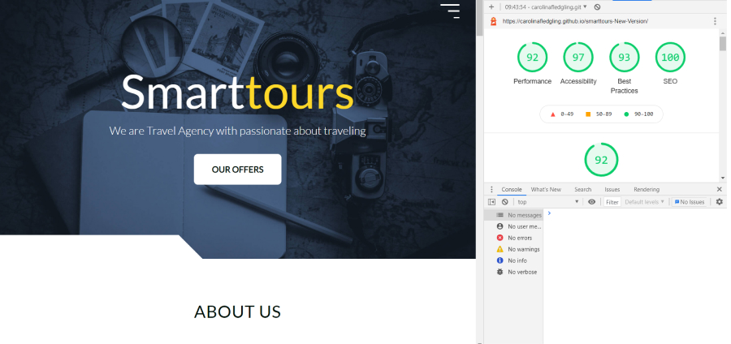

# Smarttours-New-Version

## Description 
This project is made independently and without any starter code. It is made with HTML, CSS, SASS, JavaScript and plugin Slick.
While creating the website I solved a many problems and learned many new things.

## General info
The project required me to build a simple landing page for Travel agency

## Focusing on :
- Clear content and easy to navigate. 🚀
- Built with HTML, CSS and JavaScript 🚀
- Vanilla JavaScript implementation of smart navigation and animate on scroll 🚀
- Perfect scores on accessibility, performance, best practices and SEO 🚀

## Design What I did:
- Tried to keep design balanced 
- Picked three base colors
- Picked the right font ( font is key to having a good website design,  Be mindful of the load times, remember about readable contrast)
- Added white space around elements to make them stand out.

## Status

Project is: _in progress_,

## Preview the website live on : [DEMO]( https://carolinafledgling.github.io/smarttours-New-Version/)

## Lighthouse

